## Begonia auriculata
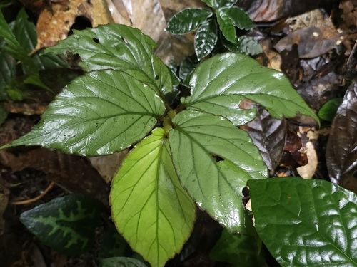

Common Name: Begonia auriculata
Scientific Name: Begonia auriculata

Description:
Begonia auriculata is a decorative foliage plant known for its textured green leaves and ornamental appeal. It grows well in shaded environments and humid climates. This species is commonly cultivated for its attractive leaf structure and compact growth habit.

---
## Begonia bevirimosa

Common Name: Begonia bevirimosa
Scientific Name: Begonia bevirimosa

Description:
Begonia bevirimosa is valued for its patterned foliage and unique leaf coloration. It thrives in indirect light and moist soil conditions. This plant is often grown as an ornamental indoor or garden plant.

---
## Begonia cucullata
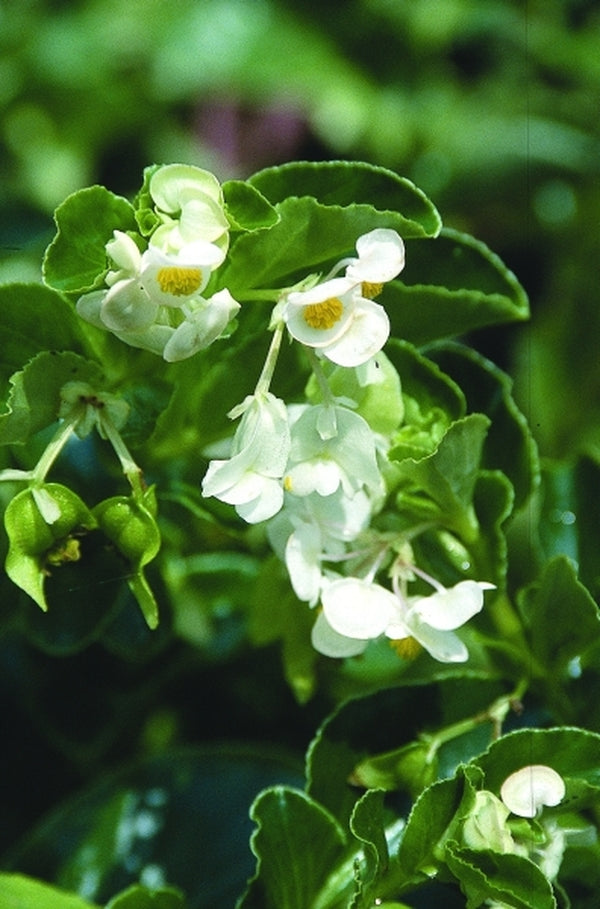

Common Name: Wax Begonia
Scientific Name: Begonia cucullata

Description:
Begonia cucullata is a popular flowering begonia known for its glossy leaves and small colorful blooms. It grows well in warm climates and is commonly used in landscaping, borders, and garden beds.

---
## Begonia maculata
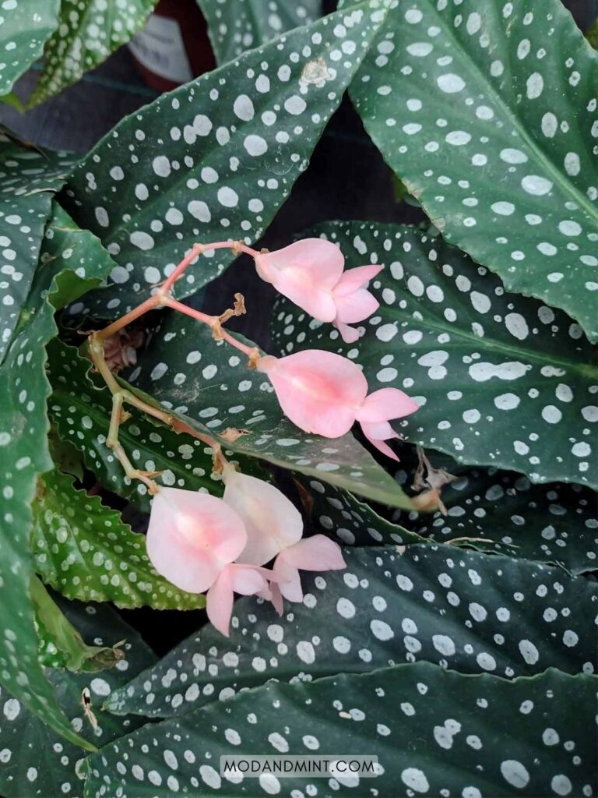

Common Name: Polka Dot Begonia
Scientific Name: Begonia maculata

Description:
Begonia maculata is famous for its angel-wing shaped leaves with silver polka dots and reddish undersides. It is widely grown as a houseplant due to its striking foliage and elegant appearance.

---
## Begonia masoniana
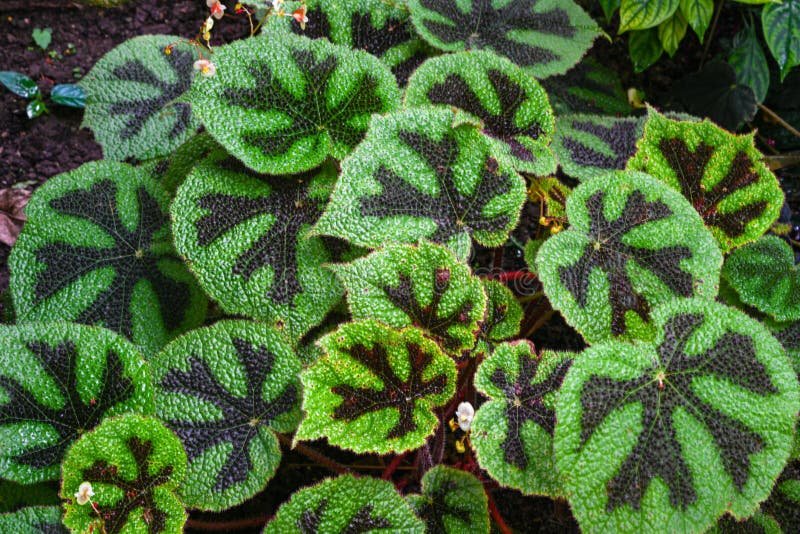

Common Name: Iron Cross Begonia
Scientific Name: Begonia masoniana

Description:
Begonia masoniana is known for its large green leaves marked with a dark cross pattern in the center. It prefers shaded environments and high humidity. This plant is mainly grown for its dramatic foliage.

---
## Begonia rex

Common Name: Rex Begonia
Scientific Name: Begonia rex

Description:
Begonia rex is highly valued for its colorful and textured leaves. The foliage comes in various patterns of silver, purple, red, and green. It is commonly grown indoors as an ornamental plant.

---
## Begonia tigerpaw
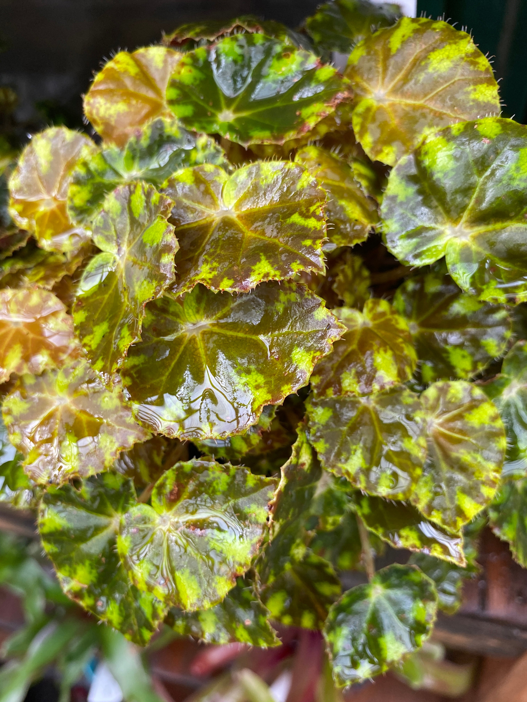

Common Name: Tiger Paw Begonia
Scientific Name: Begonia tigerpaw

Description:
Begonia tigerpaw is known for its bold leaf patterns and vibrant coloration. It is a compact plant that thrives in shaded areas and is commonly grown as a decorative houseplant.

---
## Begonia dregei
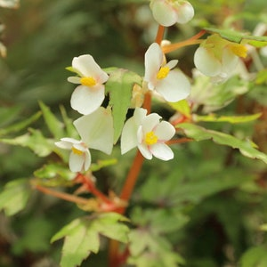

Common Name: Maple Leaf Begonia
Scientific Name: Begonia dregei

Description:
Begonia dregei features uniquely shaped leaves resembling maple leaves. It is a semi-succulent species that grows well in well-drained soil and partial shade.

---
## Begonia foliosa
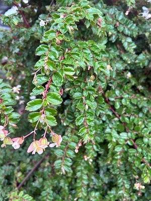

Common Name: Trailing Begonia
Scientific Name: Begonia foliosa

Description:
Begonia foliosa is a delicate trailing species with small leaves and soft pink flowers. It is often grown in hanging baskets or containers due to its cascading growth habit.

---
## Begonia imperialis
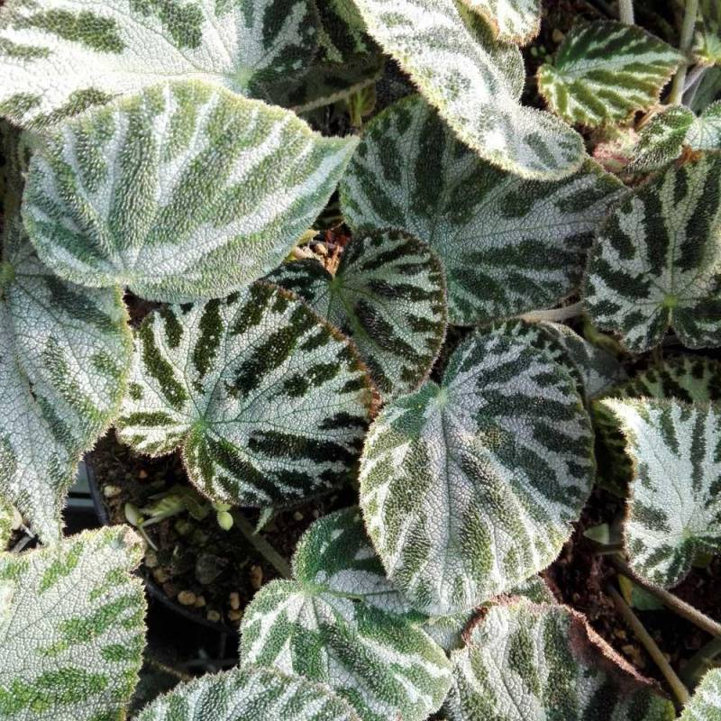

Common Name: Imperial Begonia
Scientific Name: Begonia imperialis

Description:
Begonia imperialis is admired for its velvety leaves and rich coloration. It prefers shaded conditions and is commonly grown for ornamental purposes.

---
## Begonia listada
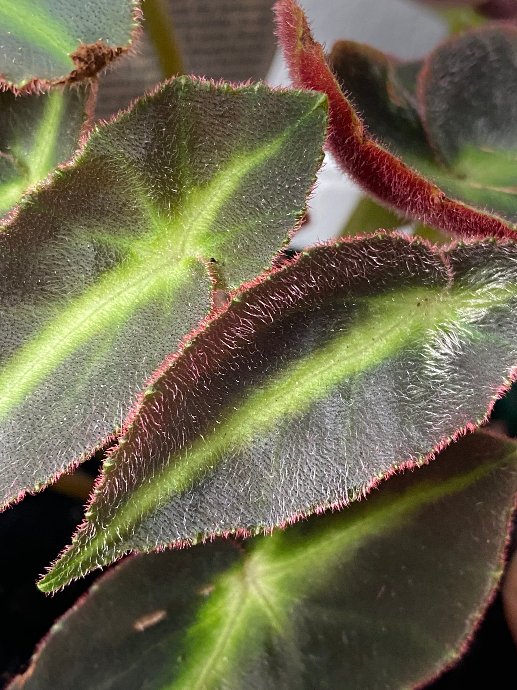

Common Name: Striped Begonia
Scientific Name: Begonia listada

Description:
Begonia listada has dark green leaves with a bright central stripe and reddish underside. It is compact and well-suited for indoor growing.

---
## Begonia luxurians
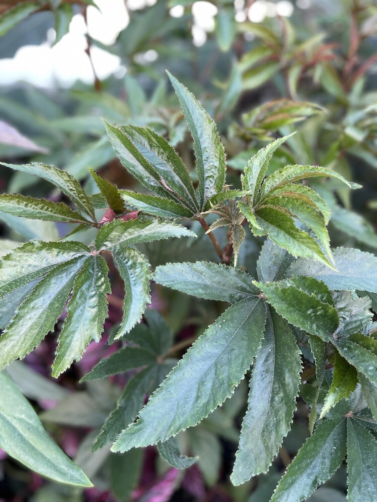

Common Name: Palm Leaf Begonia
Scientific Name: Begonia luxurians

Description:
Begonia luxurians has long, palm-like leaves that give it a tropical appearance. It grows larger than many begonias and thrives in warm, humid conditions.

---
## Begonia versicolor
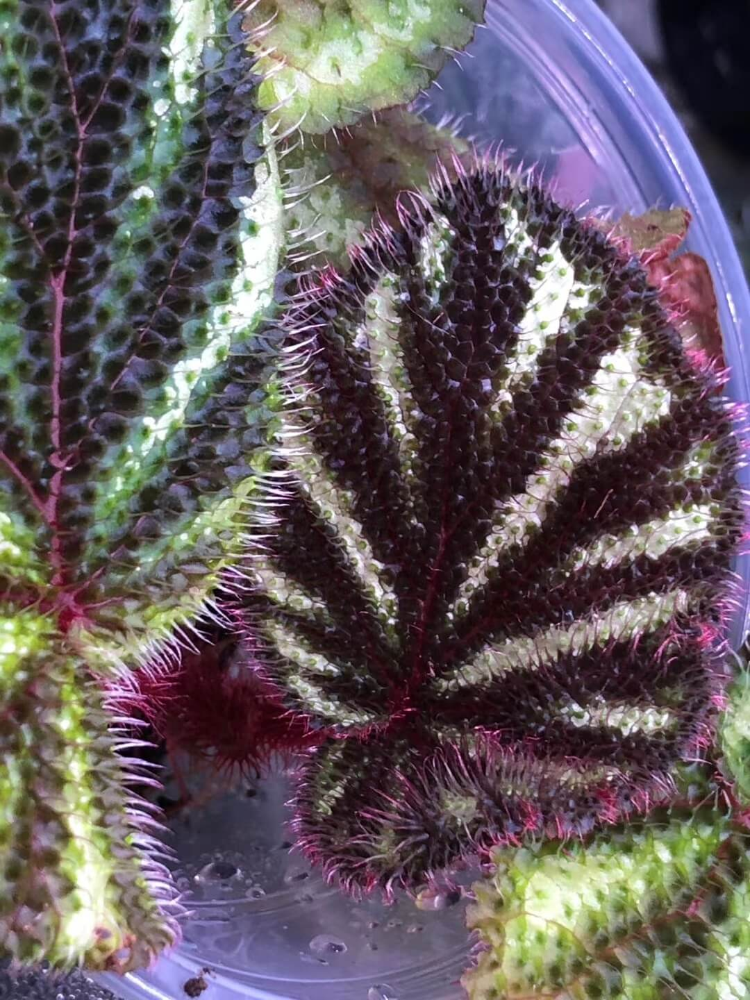

Common Name: Versicolor Begonia
Scientific Name: Begonia versicolor

Description:
Begonia versicolor is known for its colorful foliage that changes shades depending on lighting conditions. It is grown mainly for decorative foliage display.

---
## Begonia sutherlandii
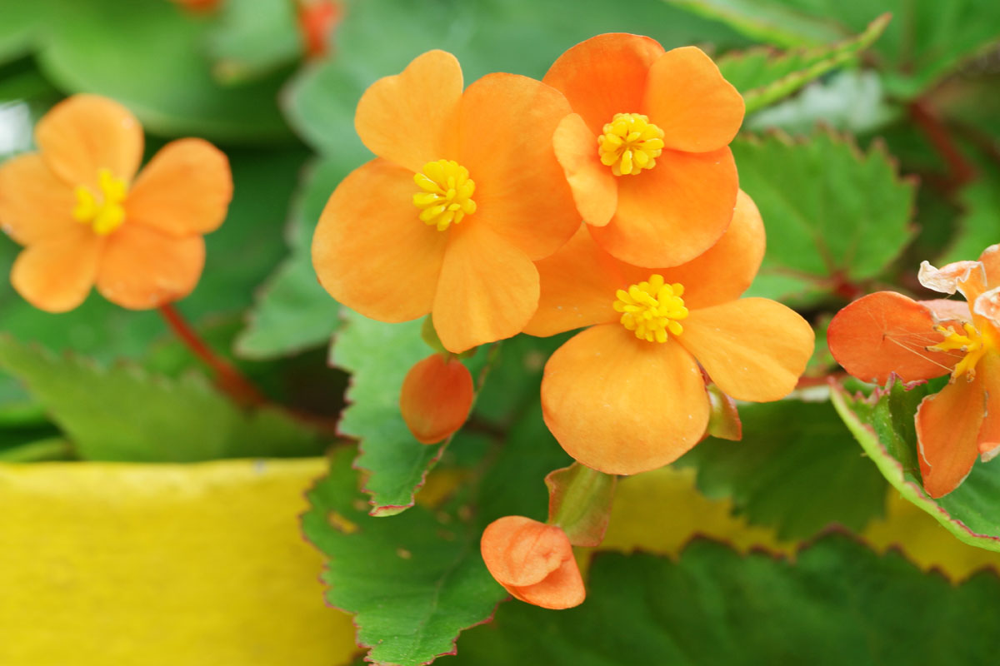

Common Name: Sutherland Begonia
Scientific Name: Begonia sutherlandii

Description:
Begonia sutherlandii produces delicate orange flowers and small green leaves. It grows well in containers and shaded garden areas.

---
## Begonia cleopatrae
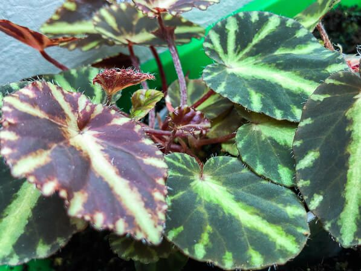

Common Name: Cleopatra Begonia
Scientific Name: Begonia cleopatrae

Description:
Begonia cleopatrae has star-shaped leaves with intricate patterns. It is commonly grown indoors where humidity levels are controlled.

---
## Begonia boliviensis
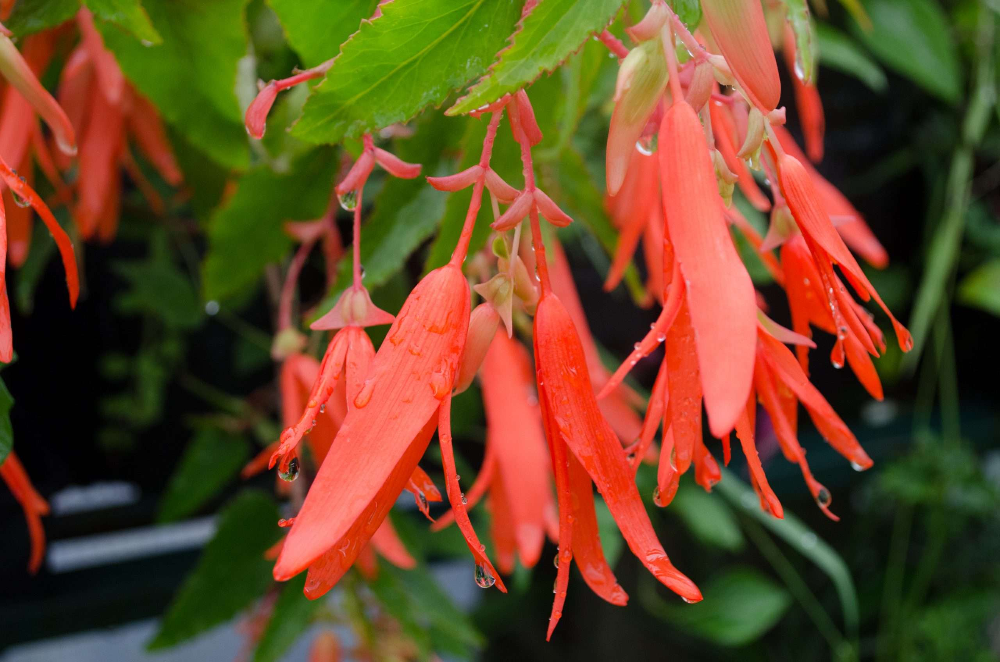

Common Name: Bolivian Begonia
Scientific Name: Begonia boliviensis

Description:
Begonia boliviensis is known for its bright orange or red tubular flowers. It is commonly planted in hanging baskets and garden containers.

---
## Begonia pearcei
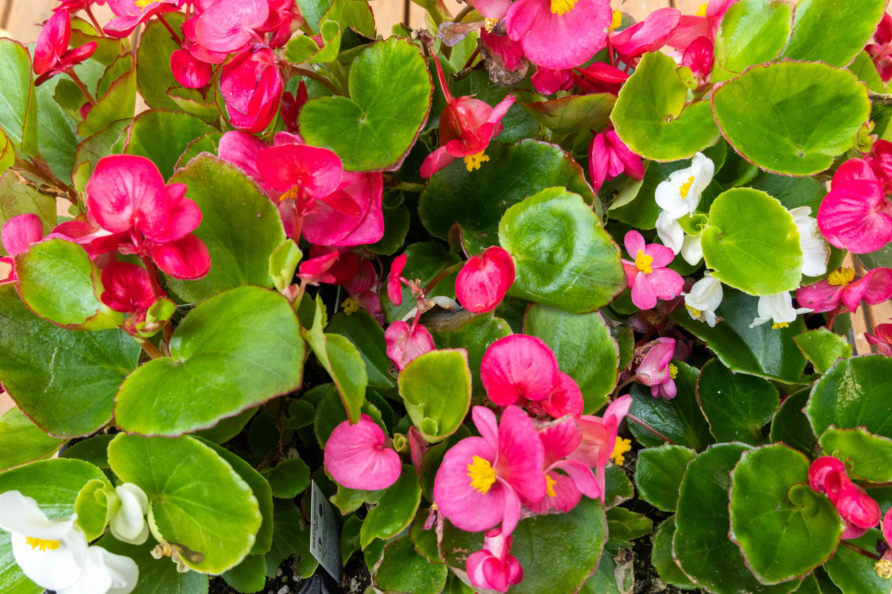

Common Name: Pearcei Begonia
Scientific Name: Begonia pearcei

Description:
Begonia pearcei features dark green leaves with red veins and yellow flowers. It is grown as an ornamental plant in shaded environments.

---
## Begonia acetosa
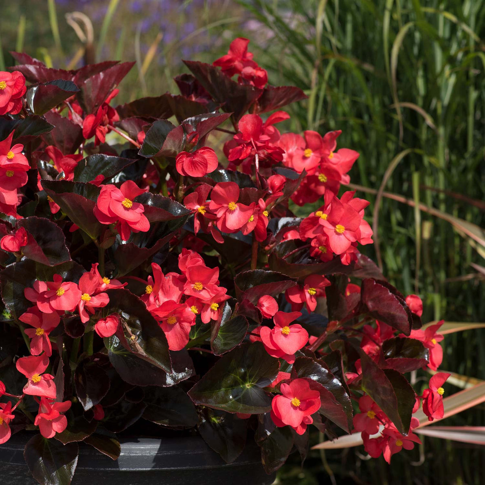

Common Name: Red Leaf Begonia
Scientific Name: Begonia acetosa

Description:
Begonia acetosa is known for its deep red underside and glossy green upper leaves. It thrives in indirect light and humid conditions.

---
## Begonia mannii
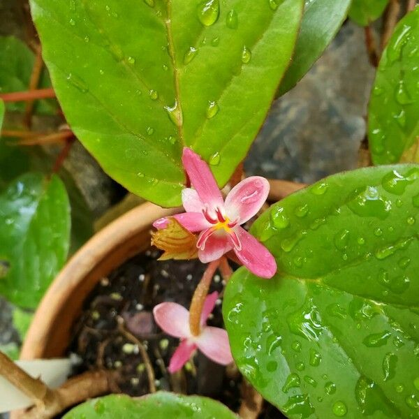

Common Name: Mannii Begonia
Scientific Name: Begonia mannii

Description:
Begonia mannii is a flowering species that produces clusters of small blossoms. It grows best in shaded tropical environments and is valued for both foliage and flowers.

---

1. How did the number of images per class affect your model’s accuracy?

The number of images per class significantly affected the model’s accuracy. Classes with more images allowed the model to learn better feature patterns, resulting in higher accuracy. In contrast, classes with fewer images provided limited training data, which reduced the model’s ability to generalize and led to lower accuracy.

2. Which plant species were most commonly misclassified and why?

Chili varieties such as Cayenne, Thai Chili, and Long Green Chili were most commonly misclassified. These species have very similar shapes, sizes, and colors, making it difficult for the model to distinguish between them. The visual similarities caused confusion during classification.

3. How did changing the epochs, batch size, or learning rate affect the training results?

Increasing the number of epochs generally improved accuracy because the model had more time to learn from the data. However, too many epochs resulted in overfitting, where the model performed well on training data but poorly on validation data.

Improper batch size and learning rate settings also affected performance. A batch size that was too large or too small made training unstable, while an inappropriate learning rate either slowed down learning or caused the model to fail to converge properly.

4. What challenges did you encounter during dataset collection and labeling?

One major challenge was the imbalance in the dataset, as some chili types had fewer available images. Additionally, some collected images were blurred, low-quality, or had inconsistent backgrounds. Labeling was also challenging because several chili varieties look very similar, increasing the risk of incorrect classification.

5. If you improve your model, what will you change and why?

To improve the model, I would increase the number of images for each class to create a more balanced dataset. I would also apply data augmentation techniques such as rotation, zooming, and brightness adjustment to improve the model’s ability to generalize. These improvements would help increase accuracy and reduce misclassification.
